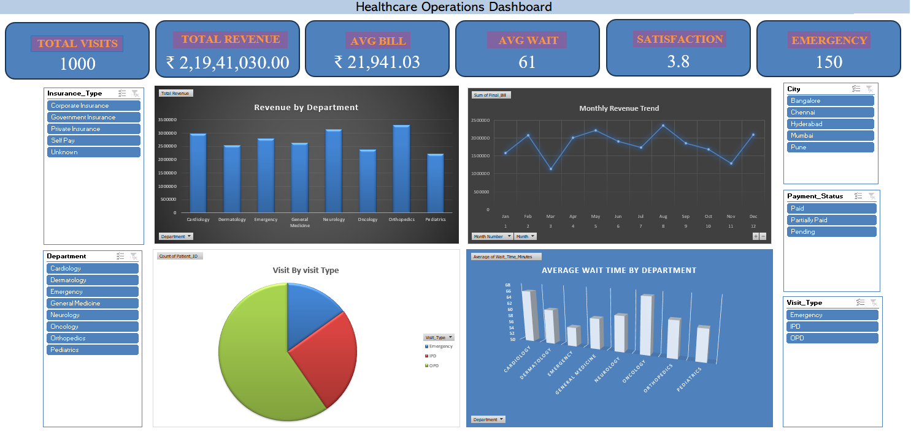

# 🏥 Healthcare Operations Dashboard

## 📊 Project Overview

The Healthcare Operations Dashboard is an interactive Excel-based analytics project designed to monitor and analyze healthcare operational performance.

The dashboard transforms raw healthcare data into meaningful KPIs and interactive visualizations, helping users understand patient visits, revenue, billing, waiting time, satisfaction levels, and department performance.

## 🎯 Project Objectives

- Analyze healthcare visit and operational data
- Track important healthcare KPIs
- Monitor revenue and billing performance
- Analyze patient waiting times
- Understand patient satisfaction
- Compare department and visit-type performance
- Provide interactive filtering for better data exploration
- Build a professional dashboard suitable for business reporting

## 🛠️ Tools & Technologies

- Microsoft Excel
- PivotTables
- PivotCharts
- Excel Slicers
- Advanced Excel
- Data Cleaning
- Data Analysis
- Data Visualization
- KPI Reporting

## 📁 Workbook Structure

The Excel workbook contains the following sheets:

| Sheet | Description |
|---|---|
| Raw_Data | Original healthcare operational data |
| Data_Cleaning | Data preparation and cleaning |
| KPI_Analysis | KPI calculations and analysis |
| Pivot tables | PivotTables used for analysis and dashboard visuals |
| Healthcare_Dashboard | Final interactive dashboard |

## 📌 Key KPIs

The dashboard tracks:

- Total Visits
- Total Revenue
- Average Bill
- Average Waiting Time
- Patient Satisfaction
- Emergency Visits

## 📈 Dashboard Features

### Interactive Filters

The dashboard includes slicers for:

- Insurance Type
- City
- Department
- Payment Status
- Visit Type

These filters allow users to interactively explore healthcare operations and dynamically analyze the KPIs and visualizations.

### Visualizations

The dashboard includes:

- Revenue by Department
- Monthly Revenue Trend
- Visits by Visit Type
- Average Waiting Time by Department

## 🔄 Project Workflow

```text
Raw Healthcare Data
        ↓
Data Cleaning
        ↓
Data Preparation
        ↓
PivotTables
        ↓
KPI Analysis
        ↓
Interactive Dashboard
        ↓
Business Insights

## 📷 Dashboard Preview



## 💡 Key Skills Demonstrated

- Data Cleaning
- Data Analysis
- Advanced Excel
- PivotTables
- PivotCharts
- Excel Slicers
- KPI Development
- Dashboard Design
- Data Visualization
- Business Reporting
- Analytical Thinking
- Data Interpretation

## 📂 Project Files

### Healthcare_Operations_Dashboard.xlsx

Complete Excel workbook containing the raw data, data cleaning, KPI analysis, PivotTables, and interactive dashboard.

### Dashboard_Screenshot.png

Preview image of the final Healthcare Operations Dashboard.

## 📌 Project Outcome

This project demonstrates how raw healthcare operational data can be transformed into an interactive and professional analytical dashboard using Microsoft Excel.

The dashboard enables users to explore healthcare performance through dynamic KPIs, interactive filters, and visual analysis.

## 👩‍💻 Author

**Manaswini Bingi**

Data & Business Analyst | Data Analysis | Business Intelligence | Excel | SQL | Power BI
